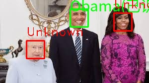

# 人脸识别系统 (Face Recognition System) V2.0

> 🎓 本项目可作为 **Python 课程人脸识别期末作业** 参考，涵盖图像处理、机器学习模型训练、视频流分析等完整流程。

## 项目简介

基于 Python + OpenCV + `face_recognition` 开发的人脸识别系统。支持通过少量参考照片训练模型，对图片、视频、摄像头进行实时人脸识别与标注。

## 核心功能

| 功能 | 说明 |
|------|------|
| **图片识别** | 单张或批量文件夹扫描，识别目标人物并标注保存 |
| **视频识别** | 输入视频 → 输出 H.264 MP4（VS Code 可直接播放），每帧人脸画框标注 |
| **摄像头实时** | 摄像头实时捕捉，逐帧比对已知人脸 |
| **自动训练** | 将照片放入 `face_dataset/姓名/` 目录，运行选项 3 即可自动提取特征 |
| **自动学习** | 图片识别模式下发现匹配目标，自动保存人脸截图扩充数据集 |

## 技术栈

- **语言**: Python 3.12
- **人脸识别**: `face_recognition`（基于 `dlib`）
- **图像处理**: OpenCV (`cv2`)、Pillow
- **环境管理**: `uv`（项目依赖管理）
- **视频编码**: `libx264`（H.264 MP4，通用播放器兼容）

## 快速上手

### 1. 从 GitHub 克隆项目

```bash
git clone https://github.com/Witylk/FaceDemo-.git
cd FaceDemo-
```

### 2. 安装 uv 环境管理工具

**Linux / macOS：**
```bash
curl -LsSf https://astral.sh/uv/install.sh | sh
```

**Windows（PowerShell）：**
```powershell
powershell -ExecutionPolicy ByPass -c "irm https://astral.sh/uv/install.ps1 | iex"
```

### 3. 安装依赖

```bash
uv sync
```

> ⚠️ **Windows 注意**：`dlib` 需要 C++ 编译环境。
> 如果 `uv sync` 编译 `dlib` 失败，请尝试以下替代方案：
>
> **方案一（推荐）**：从 [dlib-wheels](https://github.com/z-mahmud22/dlib-wheels/releases) 下载预编译的 `.whl` 文件。
> 下载时选择与你 Python 版本匹配的文件，例如 `dlib-19.24.2-cp312-cp312-win_amd64.whl`（cp312 = Python 3.12，win_amd64 = 64位 Windows）。
> 下载后打开终端进入项目目录，运行：
> ```powershell
> pip install .\下载的\dlib-19.24.2-cp312-cp312-win_amd64.whl
> uv sync
> ```
>
> **方案二**：使用 conda 安装：
> ```powershell
> conda install -c conda-forge dlib
> ```

### 4. 准备数据集

将目标人物的照片放入 `face_dataset/` 目录，每人一个文件夹：

```
face_dataset/
├── Obama/
│   ├── portrait1.jpg
│   └── ...
└── Trump/
    ├── photo1.jpg
    └── ...
```

### 5. 首次训练

```bash
uv run main.py
```

进入菜单后先选择 **3. ★ 重新训练模型 ★**，等待训练完成。

### 6. 开始识别

训练完成后回到主菜单，选择 **1. 识别模式**：

```
 >> 1. 图片/文件夹筛选    ← 输入图片或文件夹路径
 >> 2. 摄像头实时         ← 使用摄像头实时识别
 >> 3. 视频文件处理       ← 输入视频路径，输出 H.264 MP4
```

## Windows 兼容性说明

| 功能 | Windows | 说明 |
|------|---------|------|
| 图片识别 | ✅ 支持 | 未发现兼容性问题 |
| 视频识别 | ✅ 支持 | 使用内置静态 ffmpeg 编码，不依赖系统编解码器 |
| 摄像头实时 | ✅ 支持 | 自动回退到默认摄像头驱动 |
| 中文显示 | ✅ 支持 | 自动检测 `C:/Windows/Fonts/simhei.ttf` 等中文字体 |
| dlib 安装 | ⚠️ 需手动处理 | 见上方第 3 步的 Windows 注意 |

**在 Windows 上运行额外提示：**
- 建议使用 **Python 3.12**（与项目测试版本一致）
- 如果 `uv sync` 卡在 `dlib` 编译，直接下载预编译 `.whl` 文件安装
- 中文字体路径已配置 Windows 默认路径（黑体、微软雅黑），无需额外设置

## 测试资源

`test2/` 目录包含可直接测试的视频：

| 文件 | 时长 | 内容 |
|------|------|------|
| `obama_speech.mp4` | 19 秒 | 欧巴马演講近景 |
| `trump_speech.mp4` | 20 秒 | 川普戴帽演講 |
| `trump_weekly.mp4` | 20 秒 | 川普每週演講（正面直視鏡頭） |

识别结果保存在 `rec1ognition_results/` 目录，H.264 MP4 格式，VS Code 可直接预览。

## 识别效果展示

**图片识别** — 从文件夹中筛选出目标人物并标注：



**视频识别** — 川普每周演说识别结果（可直接播放）：

https://raw.githubusercontent.com/Witylk/FaceDemo-/main/rec1ognition_results/trump_weekly_identified.mp4

> 💡 **提示**：识别过程中按 **q** 键可退出视频/摄像头预览窗口。
> ⭐ 如果本项目对你有帮助，请在 GitHub 右上角点 **Star** 收藏支持！

## 配置

在 `main.py` 顶部可调整：

```python
DATASET_DIR = "face_dataset"       # 数据集目录
MODEL_FILE = "face_model1.pkl"     # 模型文件
THRESHOLD = 0.45                   # 识别阈值（越小越严格）
PADDING_RATIO = 0.25               # 自动裁切边距
ADMIN_PASSWORD = "SZTU"            # 录入人脸密码
```

> **提示**: 如果视频识别率偏低，可将 `THRESHOLD` 调至 `0.5` ~ `0.55`（`face_recognition` 默认阈值为 0.6）。

## 项目结构

```
.
├── main.py                  # 主程序
├── pyproject.toml           # uv 项目配置（依赖管理）
├── uv.lock                  # 依赖版本锁定
├── face_dataset/            # 训练数据集（每人一个文件夹）
│   ├── Obama/               # 欧巴马照片
│   └── Trump/               # 川普照片
├── test2/                   # 测试视频
├── rec1ognition_results/    # 识别输出
├── face_model1.pkl          # 训练好的模型
└── .venv/                   # 虚拟环境
```

---
⭐ **如果本项目对你有帮助，请在 GitHub 右上角点击 Star 收藏支持！**
💡 识别过程中按 **q** 键可退出视频/摄像头预览窗口。

> 开发者：Witty
